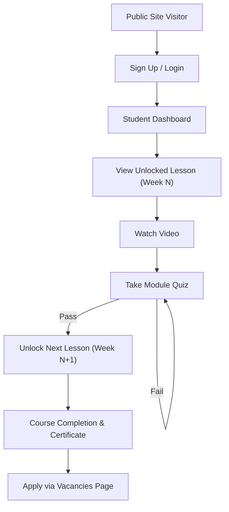

## 1. Product Overview
Openlead Academy is a premium SaaS-style learning management system (LMS) and CRM hybrid platform.
It aims to build elite sales skills through weekly-locked video lessons, quizzes, and a careers portal, targeting sales professionals.

## 2. Core Features

### 2.1 User Roles
| Role | Registration Method | Core Permissions |
|------|---------------------|------------------|
| Student | Supabase Auth (Email) | Access unlocked lessons, take quizzes, apply for vacancies |
| Trainer | Admin Invitation | View student progress, manage specific courses |
| Admin | Manual DB Flag / Invitation | Full platform control: manage users, courses, quizzes, vacancies, announcements |

### 2.2 Feature Module
1. **Public Pages**: Home, About Us, Vacancies, Contact
2. **Auth System**: Login, Signup, Forgot Password
3. **Student Portal Dashboard**: Progress tracking, Curriculum Timeline, Announcements, Quick Links
4. **Learning Engine**: Video embeds (YouTube), Quiz System, Certificate Generation
5. **Admin Panel**: Content management, user management, analytics

### 2.3 Page Details
| Page Name | Module Name | Feature description |
|-----------|-------------|---------------------|
| Home | Hero & Landing | Animated intro, "How it Works" timeline, stats, testimonials, FAQ |
| Vacancies | Careers Portal | Dynamic job listings, filters, application form with CV upload |
| Student Dashboard | Dashboard | Circular progress, weekly unlocked curriculum cards, live announcements |
| Lesson Detail | Video Player | YouTube embed, progress tracking, "Next Lesson" or "Take Quiz" lock logic |
| Admin Panel | Management | Data tables for students, content creation forms for lessons/quizzes |

## 3. Core Process
The primary user flow involves onboarding, learning progression, and job application.

## 4. User Interface Design
### 4.1 Design Style
- **Primary Color**: White/Light Grey with subtle teal accents (#12C7C1).
- **Style**: Premium SaaS (similar to Linear, Notion, Stripe).
- **Elements**: Smooth shadows, large padding, 2xl rounded cards, minimal clutter, soft gradients.
- **Typography**: Modern typography, strong visual hierarchy.
- **Animations**: Framer Motion fade-ins, hover transitions, floating UI, skeletons, toast notifications.

### 4.2 Page Design Overview
| Page Name | Module Name | UI Elements |
|-----------|-------------|-------------|
| Dashboard | Layout | Left sidebar, top bar with avatar/notifications, main content area |
| Dashboard | Progress Card | Circular completion chart, progress bar, sleek metrics |
| Curriculum | Timeline | Locked/Unlocked states, thumbnails, smooth expand/collapse |

### 4.3 Responsiveness
Desktop-first approach, fully responsive to mobile and tablet devices with adaptive sidebars and grids.
