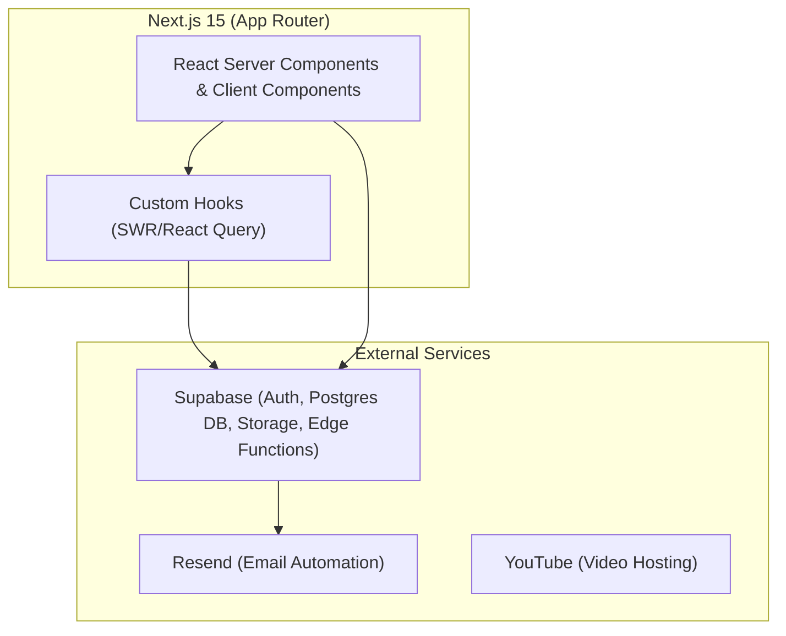
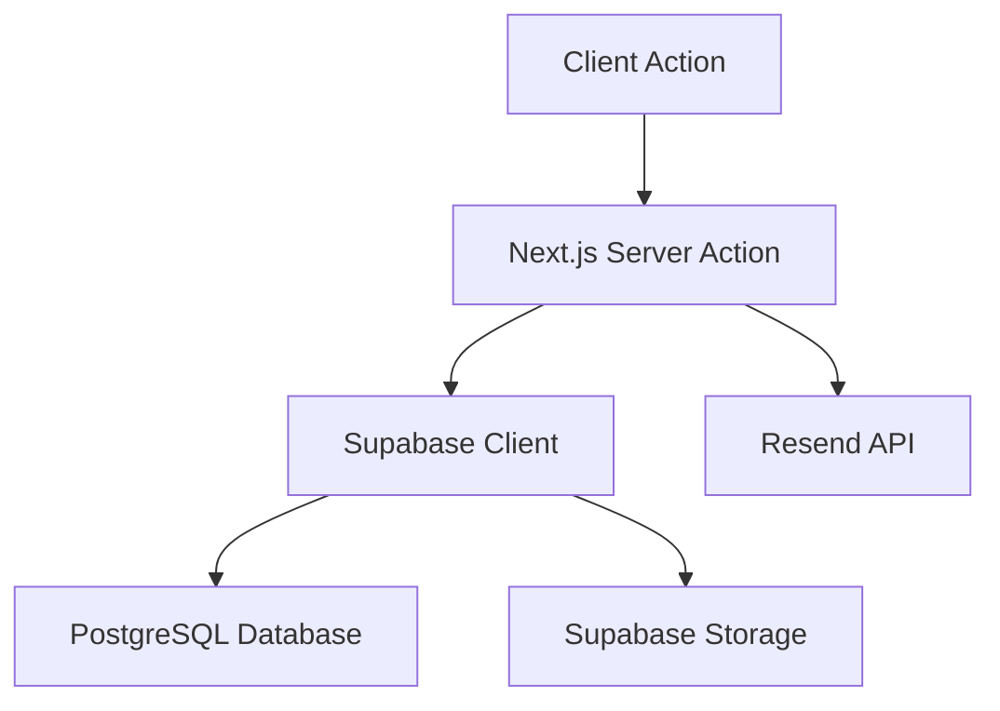
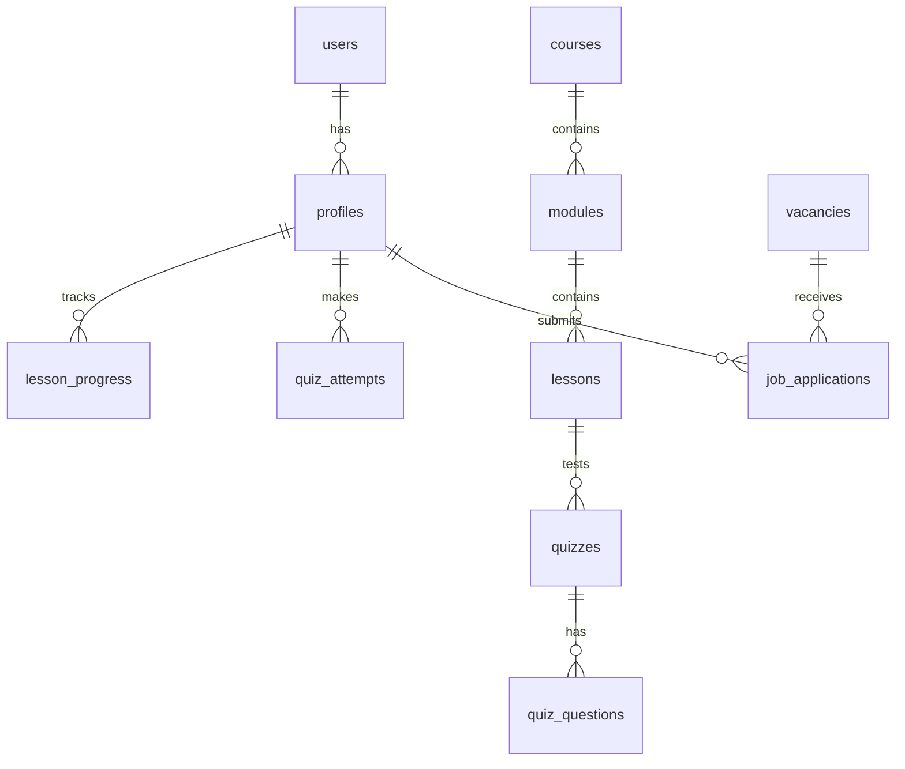

## 1. Architecture Design


## 2. Technology Description
- **Frontend**: Next.js 15, React 19, TypeScript, TailwindCSS, shadcn/ui, Framer Motion
- **Backend/Database/Auth**: Supabase (PostgreSQL, GoTrue, Storage)
- **Deployment**: Vercel
- **Email**: Resend

## 3. Route Definitions
| Route | Purpose |
|-------|---------|
| `/` | Home page |
| `/about` | About Us page |
| `/vacancies` | Careers portal and job listings |
| `/contact` | Contact page |
| `/login`, `/signup` | Authentication pages |
| `/dashboard` | Student portal main view |
| `/dashboard/lessons/[id]` | Video learning view |
| `/dashboard/quizzes/[id]` | Quiz taking interface |
| `/admin` | Admin management routes |

## 4. API Definitions
Most data access will occur directly via Supabase Client (RLS secured) in Server Components and Server Actions.
Email automation will utilize Server Actions:
```typescript
type ApplicationPayload = {
  vacancyId: string;
  candidateName: string;
  email: string;
  cvUrl: string;
}
// POST /api/apply or Server Action: submitApplication(data: ApplicationPayload)
```

## 5. Server Architecture Diagram


## 6. Data Model
### 6.1 Data Model Definition


### 6.2 Data Definition Language
Supabase schema will include standard tables (simplified for architecture overview):
```sql
CREATE TABLE profiles (
  id UUID REFERENCES auth.users(id) PRIMARY KEY,
  role TEXT DEFAULT 'student',
  full_name TEXT,
  avatar_url TEXT,
  created_at TIMESTAMPTZ DEFAULT NOW()
);
CREATE TABLE courses (
  id UUID PRIMARY KEY DEFAULT uuid_generate_v4(),
  title TEXT NOT NULL,
  description TEXT
);
-- Additional tables: modules, lessons, quizzes, quiz_questions, quiz_attempts, lesson_progress, certificates, announcements, resources, vacancies, job_applications, support_tickets.
```
